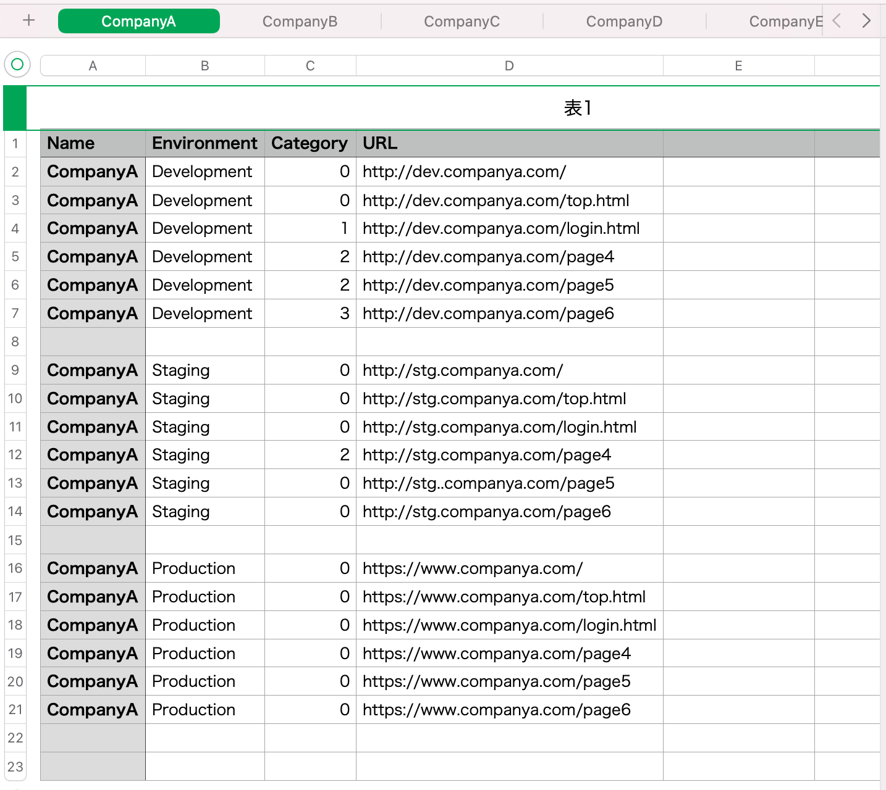
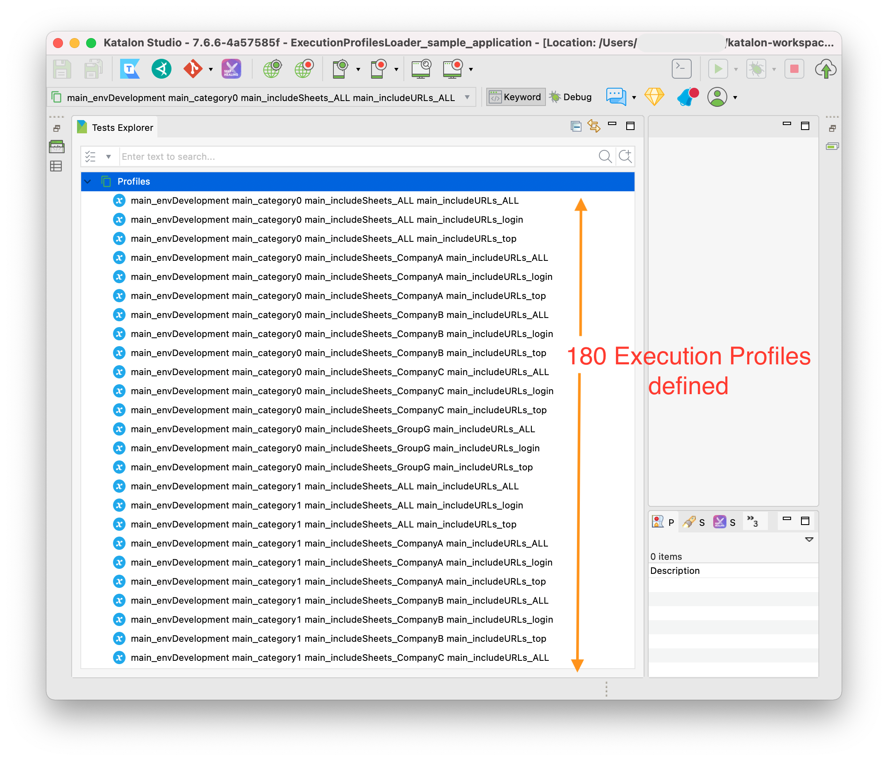

ExecutionProfilesLoader
======================

# Problem to solve

I have developed and published a tool named [VisualTestingInKatalonStudio](https://forum.katalon.com/t/visual-testing-in-katalon-studio/13361) project on top of [Katalon Studio](https://www.katalon.com/katalon-studio/), which enables me to take screenshots of a Web service on browser and to compare the images between environments (Development and Production) or between 2 different timings (before and after system changes).

Last year (2020) I worked for an [Application Service Provider (ASP)](https://en.wikipedia.org/wiki/Application_service_provider) in financial industry. They had approximately 40 customers, they provided many URLs to customers: 50 URL as average per a single customer. The Web system maintained 3 environments (Development, Staging, Production) for every customers. This resulted 40 * 50 * 3 = 6000 URL to test.

A collegue who is in charge of this service created a large Excel workbook file which has 40 sheets where the urls for each customers are listed. The following picture shows how it looked like:



I developed a Katalon Studio project which works on top of the Visual Testing framework supplied with the configuration file which contains 6000 URLs.

However, a problem arose. The Visual Testing tool takes approximately 10 seconds per a single URL to test. So if I ran the tool against all 6000 URL, it would take me 6000 * 10 seconds = over 17 hours. Obviously it's too long. 

I wanted to select smaller number of URLs by some criteria out of the spreadsheets to make the test run in a shorter time period. If I choose 60 URLs, then the tool will run in 600 seconds = 10 minutes. That's OK. 10 minutes break of work for tea is welcomed.

At the same time, I wanted the tool to be flexible. For example, Yesterday, I tested the production URLs for CompanyA; Today, I want to test the development URLs for CommpanyB; Tomorrow, I would want to test the staging URLs for CompanyL + CompanyM + CompanyN; next week, I have to test the production URLs which ends with a string `login.html` of all 40 customers; ...

I decided to introduce a set of **GlobalVariables** to the testing project which would express the URL selection criteria. I enumerated 5 GlobalVariables, each of which may take a range of possible values as follows:

|No.| GlobalVariable name | possible values |
|---|---|---|
|1| `CONFIG` | `'./Include/fixture/Config.xlsx'` |
|2| `ENVIRONMENT` | <ul><li>`Development`</li><li>`Production`</li><li>`Staging`</li></ul>|
|3| `CATEGORY` | <ul><li>0</li><li>1</li><li>2</li><li>3</li><li>4</li></ul> |
|4| `INCLUDE_SHEETS` | <ul><li>`[]`</li><li>`['CompanyA']`</li><li>`['CompanyB']`</li><li>`['CompanyC']`</li><li>`['CompanyL', 'CompanyM', 'CompanyN']`</li></ul><span>in fact the value range is wider ... say 40<span> |
|5| `INCLUDE_URLs` | <ul><li>`[]`</li><li>`['login.html']`</li><li>`['top.html']`</li></ul> |

OK. I can restate my problem to solve. **How can I specify a particular set of values for these 5 GlobalVariables when I execute my test in Katalon Studio?**

Now I look back the Katalon Studio features. It provides [*Execution Profile*](https://docs.katalon.com/katalon-studio/docs/execution-profile-v54.html). In an Exceution Profile, you can define a set of name=value pairs of GlobalVariables. You can create as many Execution Profiles as you want. But you should note that **you can appoint only a single Execution Profile for a test execution.**

Remember, I have quite a lot of variaties of possible selection criterias. 1 CONFIG * 3 ENVIRONMENTS * 5 CATEGORIES * 6 INCLUDE_SHEETS * 3 INCLUDE_URLs = 180. Therefore I had to create 180 Execution Profiles. The following screenshot shows how the project looked like:



It was a crasy job creating 180 Execution Profiles. Further more, the range of `GlobalVariable.INCLUDE_SHEETS' values could be much more than 4, it could be, say, 40. In that case, do I prepare 1800? No way!

I found a fundamental design problem in Katalon Studio. This problem has been outstading for me for several months since May 2020.

# Solution

If I can appoint **multiple Execution Profiles for a single test run** in Katalon Studio, then my problem will be resolved.

# Soluton Description

Let me tell you my idea. I will create just 16 Execution Profiles, which contains only a single name=value pair of GlobalVariable, as follows:

## main_Base
|No.| Profile name | GlobalVariable name | value |
|---|---|---|---|
| 1 | `main_Base` | `CONFIG` | `'./Include/fixture/Config.xlsx'` |


## main_env\*
|No.| Profile name | GlobalVariable name | value |
|---|---|---|---|
| 1 | `main_envDevelopment` | `ENVIRONMENT` | `'Development'` |
| 2 | `main_envProduction` | `ENVIRONMENT` | `'Production'` |
| 3 | `main_envStaging` | `ENVIRONMENT` | `'Staging'` |


## main_category\*
|No.| Profile name | GlobalVariable name | value |
|---|---|---|---|
| 1 | `main_category0` | `CATEGORY` | `0` |
| 2 | `main_category1` | `CATEGORY` | `1` |
| 3 | `main_category2` | `CATEGORY` | `2` |
| 4 | `main_category3` | `CATEGORY` | `3` |


## main_includeSheets\*
|No.| Profile name | GlobalVariable name | value |
|---|---|---|---|
| 1 | `main_includeSheets_ALL` | `INCLUDE_SHEETS` | `[]` |
| 2 | `main_includeSheets_CompanyA` | `INCLUDE_SHEETS` | `['CompanyA']` |
| 3 | `main_includeSheets_CompanyB` | `INCLUDE_SHEETS` | `['CompanyB']` |
| 4 | `main_includeSheets_CompanyC` | `INCLUDE_SHEETS` | `['CompanyC']` |
| 5 | `main_includeSheets_GroupG` | `INCLUDE_SHEETS` | `['CompanyL', 'CompanyM', 'CompanyN']` |

In fact, `GlobalVariable.INCLUDE_SHEETS` could have a lot more variations of values ... nearly 40.


## main_includeURLs\*
|No.| Profile name | GlobalVariable name | value |
|---|---|---|---|
| 1 | `main_includeURLs_ALL` | `INCLUDE_URLS` | `[]` |
| 2 | `main_includeURLs_login` | `INCLUDE_URLS` | `['login.html']` |
| 3 | `main_includeURLs_top` | `INCLUDE_URLS` | `['top.html']` |

The following screenshot shows these Execution Profiles prepared in my project:


## Loading multiple Execution Profiles to a test run

Now I would restate my problem again: **how can appoint multiple Execution Profiles for a single test run?**

Unfortunately Katalon Studio does not provide a feature that satisfies my requirement. Therefore I have developed custom Groovy classes in the `Keywords` directory.

- [`com.kazurayam.ks.globalvariable.ExecutionProfilesLoader`](Keywords/com/kazurayam/ks/globalvariable/ExecutionProfilesLoader.groovy)
- [`com.kazurayam.ks.globalvariable.ExpandoGlobalVariable.groovy`](Keywords/com/kazurayam/ks/globalvariable/ExpandoGlobalVariable.groovy)

In these classes I used Java Reflection API and Groovy Metaprogramming API. I'm afraind that only highly skilled programmers can read the source. So would not explain the code here.

## Demo

I have made a demo `Test Suites/main/TS1` which executes 2 test cases [`Test Cases/main/loadExecutionProfiles`](Scripts/main/loadExecutionProfiles/Scripts/main/Script1611492013057.groovy) and [`Test Cases/main/TC1`](Scripts/main/TC1/Script1611492023914.groovy)

Here I copy&past the code fragments for easier reference:

**`Test Cases/main/loadExecutionProfiles`**
```
import com.kazurayam.ks.globalvariable.ExecutionProfilesLoader

ExecutionProfilesLoader loader = new ExecutionProfilesLoader()

loader.loadProfiles('main_Base', 'main_envDevelopment', 'main_category0', 'main_includeSheets_GroupG', 'main_includeURLs_top')
```

**`Test Cases/main/TC1`**
```
import internal.GlobalVariable as GlobalVariable
import com.kazurayam.ks.globalvariable.ExpandoGlobalVariable

/**
 * Test Cases/TC1
 */
def tc = 'TC1'
println "${tc} CONFIG         : ${GlobalVariable.CONFIG}"
println "${tc} DEBUG_MODE     : ${GlobalVariable.DEBUG_MODE}"
println "${tc} ENVIRONMENT    : ${GlobalVariable.ENVIRONMENT}"
println "${tc} CATEGORY       : ${GlobalVariable.CATEGORY}"
println "${tc} INCLUDE_SHEETS : ${GlobalVariable.INCLUDE_SHEETS}"
println "${tc} INCLUDE_URLS   : ${GlobalVariable.INCLUDE_URLS}"

println "\n--- Names of GlobalVaraibles statically listed in any of Profiles ---"
ExpandoGlobalVariable.keySetOfStaticGlobalVariables().each { name ->
	println "GlobalVariable.${name}"
}

println "\n--- Names of GlobalVaraibles additionally loaded by ExecutionProfilesLoader ---"
ExpandoGlobalVariable.keySetOfAdditionalGlobalVariables().each { name ->
	println "GlobalVariable.${name}"
}

println "\n--- All name:value pairs as GlobalVariable available in the current context ---"
ExpandoGlobalVariable.keySetOfGlobalVariables().each { name ->
	println "GlobalVariable.${name} : " + GlobalVariable[name]
}
```

When I execute the TS1, I got the following output in the Console:

```
2021-01-26 22:26:23.786 INFO  c.k.katalon.core.main.TestCaseExecutor   - START Test Cases/main/TC1
TC1 CONFIG         : ./Include/fixture/Config.xlsx
TC1 DEBUG_MODE     : false
TC1 ENVIRONMENT    : Development
TC1 CATEGORY       : 0
TC1 INCLUDE_SHEETS : [CompanyL, CompanyM, CompanyN]
TC1 INCLUDE_URLS   : [top.html]

--- Names of GlobalVaraibles statically listed in any of Profiles ---
GlobalVariable.AVAR1
GlobalVariable.AVAR2
GlobalVariable.AVAR3
GlobalVariable.BVAR1
GlobalVariable.CATEGORY
GlobalVariable.CONFIG
GlobalVariable.DEBUG_MODE
GlobalVariable.EMPTY_VARIABLE
GlobalVariable.ENVIRONMENT
GlobalVariable.FOO
GlobalVariable.INCLUDE_SHEETS
GlobalVariable.INCLUDE_URLS
GlobalVariable.NULL_VARIABLE
GlobalVariable.myList

--- Names of GlobalVaraibles additionally loaded by ExecutionProfilesLoader ---
GlobalVariable.CATEGORY
GlobalVariable.CONFIG
GlobalVariable.DEBUG_MODE
GlobalVariable.ENVIRONMENT
GlobalVariable.INCLUDE_SHEETS
GlobalVariable.INCLUDE_URLS
GlobalVariable.LOADED_ENTRY1
GlobalVariable.loaded_entry2

--- All name:value pairs as GlobalVariable available in the current context ---
GlobalVariable.AVAR1 : null
GlobalVariable.AVAR2 : null
GlobalVariable.AVAR3 : null
GlobalVariable.BVAR1 : null
GlobalVariable.CATEGORY : 0
GlobalVariable.CONFIG : ./Include/fixture/Config.xlsx
GlobalVariable.DEBUG_MODE : false
GlobalVariable.EMPTY_VARIABLE : null
GlobalVariable.ENVIRONMENT : Development
GlobalVariable.FOO : BAR
GlobalVariable.INCLUDE_SHEETS : [CompanyL, CompanyM, CompanyN]
GlobalVariable.INCLUDE_URLS : [top.html]
GlobalVariable.LOADED_ENTRY1 : VALUE
GlobalVariable.NULL_VARIABLE : null
GlobalVariable.loaded_entry2 : 999
GlobalVariable.myList : null
2021-01-26 22:26:24.183 INFO  c.k.katalon.core.main.TestCaseExecutor   - END Test Cases/main/TC1
```

These output will tell you that the `ExecutionProfilesLoader` enabled me to load multiple Execption Profiles for a single test run, and I could specify a particular set of values of 5 GlobalVariables that I liked. Please note that I could avoid creating lots of Profiles, I prepared only 16 Profiles. This design is much cleaner that what I did last year.

## How to use ExecutionProfilesLoader in your own Katalon Project

You can reuse my custom Groovy classes `com.kazurayam.ks.globalvariable.ExecutionProfilesLoader` and `com.kazurayam.ks.globalvariable.ExpandoExecutionProfile` by importing a jar file into the `Drivers` folder in your own Katalon Project.

You can down load the `ExecutionProfilesLoader-x.x.jar` file from the [Releases](https://github.com/kazurayam/ExecutionProfilesLoader/releases) page.

# See also

- https://forum.katalon.com/t/linking-multiple-profiles-to-test-scripts-suites/51261
